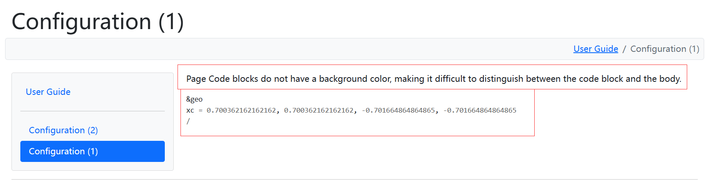

# Three BUGs with Ford 7.0?

```sh
ford ford.md
```

1. Page Code blocks do not have a background color, making it difficult to distinguish between the code block and the body.
    
2. Page code block line length is too long without line breaks, style problems.
    
3. Multiple counts and source documents.
    
